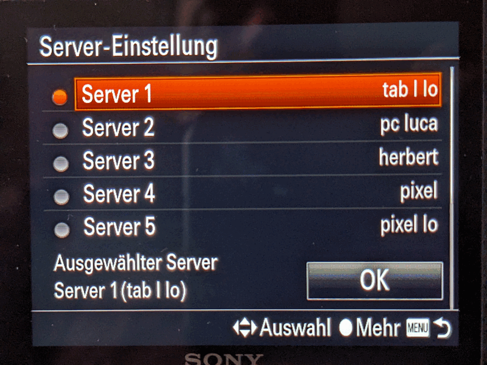
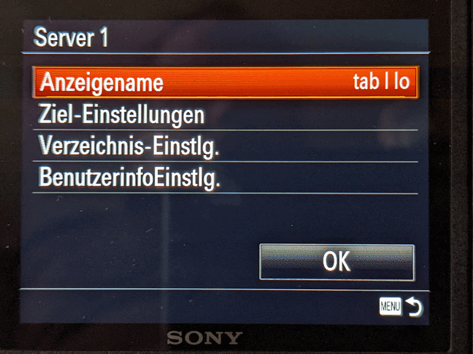
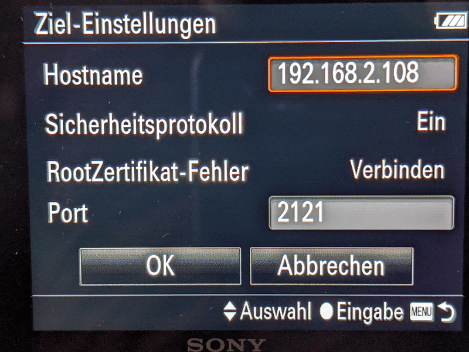
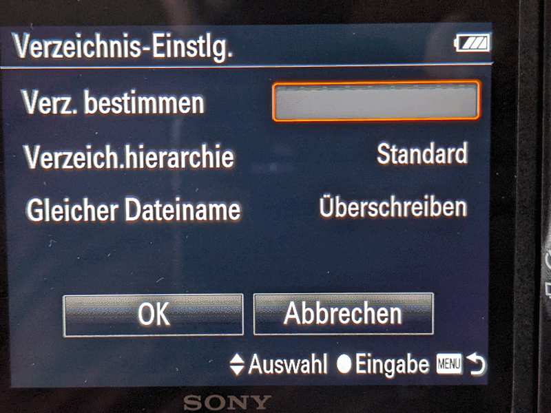
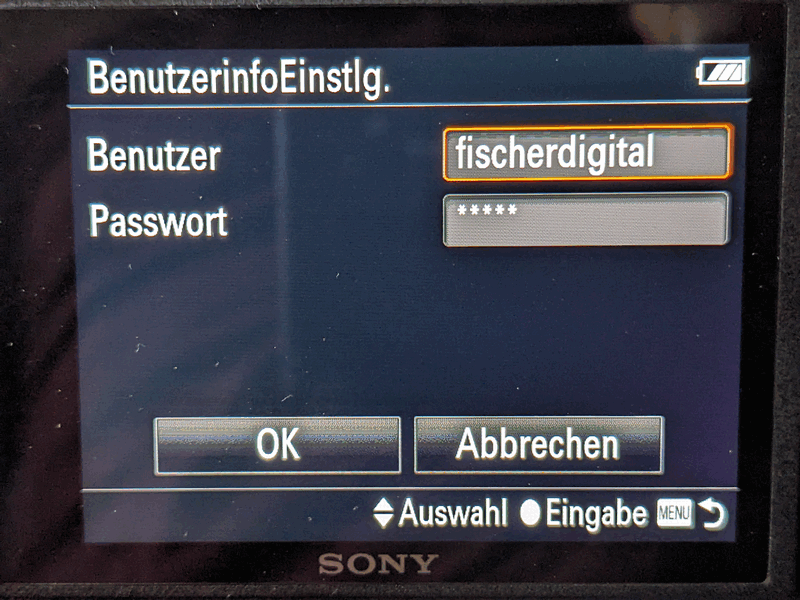
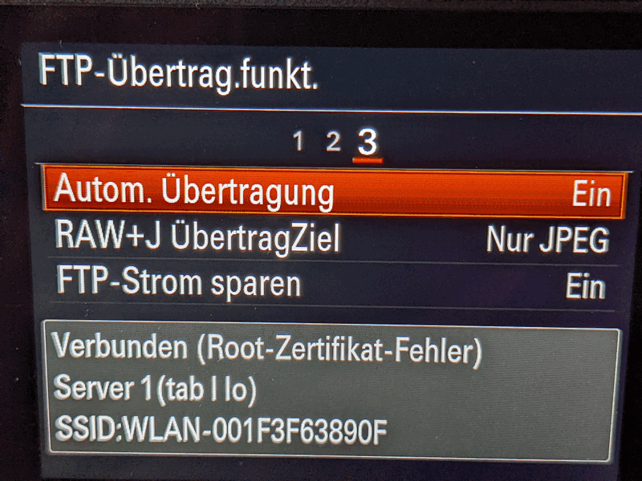
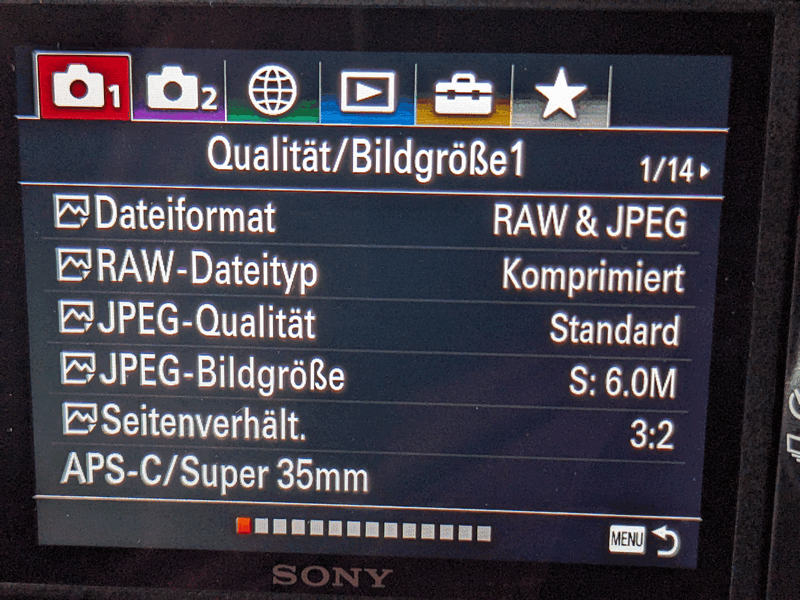

# Sony Alpha Series

**Status:** ✅ Working

**Tested models:** Sony A7III
**Not yet tested models:** Sony A7 series, A7R series, A7S series, A9, A1 (WLAN-FTP capable models)
**Date tested:** 2026

---

## Prerequisites

- Sony Alpha camera with WLAN-FTP support (most models from A7III onwards – older models may not support live FTP transfer)
- Device and camera on the same WLAN network
- FTP Tethered Shooting app installed and running

## Camera Setup

### Step 1a: Enable WLAN on the Camera

1. Press the **Menu** button
2. Navigate to: **Network2** → **Wi-Fi Settings** → **Access Point Settings**

### Step 1a: In the studio or with a mobile router

1. Connect to your studio WLAN network or your mobile router

### Step 1b: On the go

1. Enable hotspot on your Android device (note the settings)
2. Connect the camera to your hotspot
3. In the app under FTP Settings, enable "Hotspot on device required/monitor"

### Step 1c: Tips for IP address

1. When using a (custom) router, the Android device's IP can/should be fixed – then the same IP address is always required in Step 2.
2. When using the device's hotspot, a different IP is frequently used by the device (depending on whether the device is currently connected to a WLAN, among other things). Unfortunately, this cannot be prevented and requires configuration in the app.

### Step 2: Configure FTP Transfer

1. Navigate to: **Network1** → **FTP Transfer Function** → **Server Settings**

2. Select a free server slot and configure it:

3. Open **Target Settings** and configure the following:

| Setting | Value |
|---|---|
| Hostname | `[Your device's IP – shown in the app]` |
| Security Protocol | `On` |
| Root Certificate Error | `Connect` |
| Port | `2121` (shown in the app) |

4. Open **Directory Settings**:

| Setting | Value |
|---|---|
| Specify Directory | *(leave empty)* |
| Directory Hierarchy | `Standard` |
| Same File Name | `Overwrite` |

> ⚠️ **Important:** Always set the directory hierarchy to **Standard** (not "Same as camera"). Otherwise the camera creates subfolders (e.g. `DCIM/date/...`) via FTP, and the app won't detect the files.

5. Open **User Info Settings**:

| Setting | Value |
|---|---|
| User | `fischerdigital` (default, adjustable in app settings) |
| Password | Auto-generated (shown in app, adjustable in settings) |

6. Select this server (orange dot)
7. Confirm with **OK**

### Step 3: Enable Auto Transfer & File Type

1. Navigate to: **Network1** → Tab 3 → **Auto Transfer**

2. Set to **On**
3. **RAW+J. Transfer Target** → `JPEG Only`

> ⚠️ **JPG only!** Configure the camera to send only JPG files via FTP. The app cannot display RAW files, and only JPGs transfer fast enough over WLAN. A medium JPG quality (e.g. 6M / Fine) is sufficient for live review. Your RAW files stay on the memory card for later processing.

4. Navigate to: **Image Quality/Size1** (1/14)

5. **File Format** → `RAW & JPEG` or `JPEG` (depending on your shooting workflow)
6. **JPEG Quality** and **JPEG Size**: We recommend 6M and "Standard" as a good balance between quality and speed

### Step 4: Connect and Shoot

1. Start the FTP server in the app (tap the FTP button)
2. On the camera, navigate to: **Network1** → **FTP Function** → set to **On**
3. The camera connects to the device. When everything is correct, it shows: **Connected** along with the server name and WLAN name at the bottom.
> ⚠️ It also shows (Root Certificate Error). The FTP server can only use a self-signed SSL certificate locally. However, the transfer is fully secured.
4. Take photos – they transfer automatically to the app's gallery

## Tips

- **Direct Connection:** You can connect the camera directly to the device without a router. On the camera, create a WLAN access point, then connect the device to it.
- **JPG Quality:** Set JPG quality to medium (e.g. 6M) – this is sufficient for live review and keeps transfer speed fast. Avoid large/fine JPG sizes.
- **RAW stays on card:** Always keep RAW files on the camera's memory card. They are processed in your own workflow after the shoot.
- **Battery:** WLAN transfer uses more battery – consider using a battery grip for long shoots
- **FTPS:** Sony cameras support FTPS natively. The app's Explicit FTPS mode works seamlessly. On the camera, this is the "Security Protocol" setting. It works without encryption in a secure (non-public) WLAN, but offers hardly any noticeable performance advantage.

## Known Issues

- **Older models:** Some older Sony Alpha models (e.g. A7II and earlier) may not support live FTP transfer during shooting. Only models from A7III onwards have been confirmed to work.